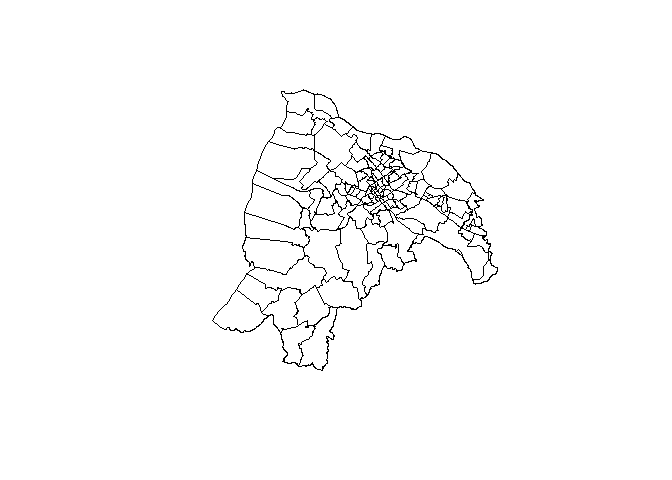

# twmap

`twmap` 是純資料集套件，蒐集了國土測繪中心(NLSC)所繪製的縣市、鄉鎮市區及村里界圖，並以 `sf` 套件的 [simple
feature](https://r-spatial.github.io/sf/articles/sf1.html)
型別儲存，因此如果要對資料進行操作的話，建議與 `sf` 套件搭配使用👍。

## Installation

``` r
# install.packages("remotes")
remotes::install_github("shihjyun/twmap")
```

## Example

### 使用套件

``` r
library(sf)
library(twmap)
```

### 使用地圖資料集

地圖資料集共有三種層級，可依據個人需求挑選使用：

  - 縣市界圖：`twmap::tw_county`

  - 鄉鎮市區界圖：`twmap::tw_town`

  - 村里界圖：`twmap::tw_village`

<!-- end list -->

``` r
twmap::tw_county

## Simple feature collection with 22 features and 4 fields
## geometry type:  MULTIPOLYGON
## dimension:      XY
## bbox:           xmin: 114.3593 ymin: 10.37135 xmax: 124.5611 ymax: 26.38528
## proj4string:    +proj=longlat +ellps=GRS80 +no_defs 
## First 10 features:
##    COUNTYID COUNTYCODE COUNTYNAME         COUNTYENG                       geometry
## 1         Z      09007     連江縣 Lienchiang County MULTIPOLYGON (((119.9645 25...
## 2         G      10002     宜蘭縣      Yilan County MULTIPOLYGON (((121.9597 24...
## 3         N      10007     彰化縣   Changhua County MULTIPOLYGON (((120.4566 24...
## 4         M      10008     南投縣     Nantou County MULTIPOLYGON (((121.2709 24...
## 5         P      10009     雲林縣     Yunlin County MULTIPOLYGON (((120.0811 23...
## 6         T      10013     屏東縣   Pingtung County MULTIPOLYGON (((120.3796 22...
## 7         C      10017     基隆市      Keelung City MULTIPOLYGON (((121.7102 25...
## 8         O      10018     新竹市      Hsinchu City MULTIPOLYGON (((120.9301 24...
## 9         A      63000     臺北市       Taipei City MULTIPOLYGON (((121.571 25....
## 10        F      65000     新北市   New Taipei City MULTIPOLYGON (((121.5375 25...
```

### 地圖簡單畫

以 simple feature 來儲存的優點是，你可以操作地圖資料就像操作 `data.frame` 一樣輕鬆！

``` r
plot(twmap::tw_village[tw_village$COUNTYNAME == "新竹市",]$geometry)
```

<!-- -->

### 我猜你還想 …

  - 更改投影方式 :
    
    可以直接使用 `sf` 套件的
    [`st_transform()`](https://r-spatial.github.io/sf/reference/st_transform.html)
    函式進行轉換！

  - 讓地圖檔案變小：
    
    使用
    [`rmapshaper`](https://cran.r-project.org/web/packages/rmapshaper/vignettes/rmapshaper.html)
    幫地圖瘦身！

  - 輸出成各種不同的檔案類型：
    
    [`st_write()`](https://r-spatial.github.io/sf/reference/st_write.html)
    可以將地圖物件輸出成一些常見的檔案類型(`.shp`, `.geojson` etc.)，而如果要輸出成 `.topojson`
    的話可以使用 [`geojsonio`](https://github.com/ropensci/geojsonio)

最後由於國土測繪中心不定時會更新資料，基本上我有注意到的話都會進行更新，大家可以呼使用 `?` 呼叫文件來看看每個地圖資料集的最後更新時間為何！
